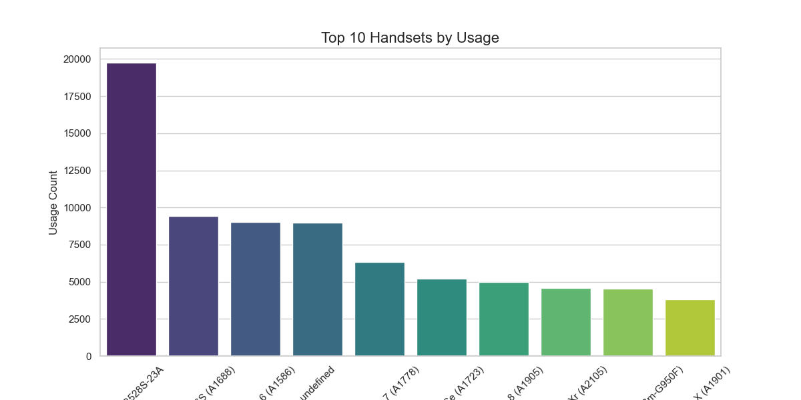
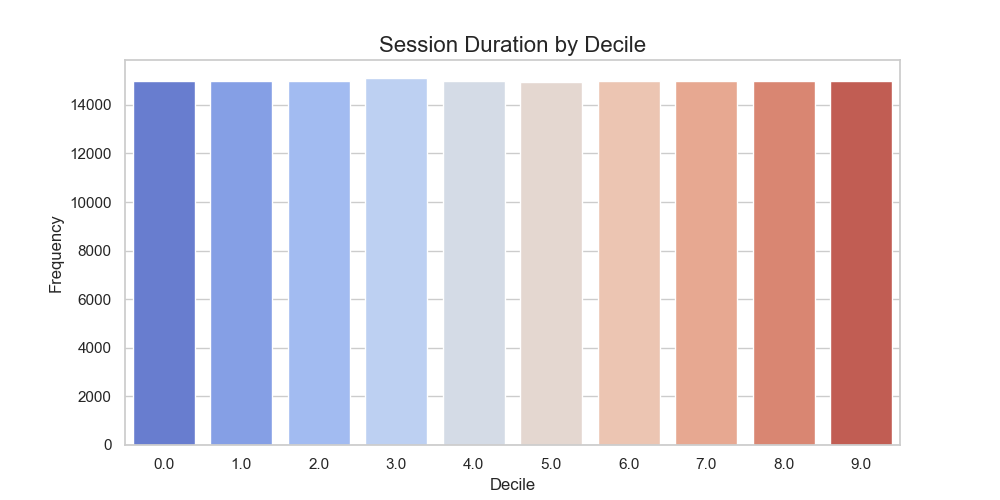

# User Overview Analysis

## Top 10 Handsets
Top handset is **Huawei B528S-23A**, which accounts for **19752** uses.

## Aggregate Metrics
- **Total Sessions**: 74,364,695,455,661.0
- **Average Session Duration**: 104609105.55 seconds
- **Total Download**: 68,196,514,511,845.0 MB
- **Total Upload**: 6,168,180,943,816.0 MB

## Visualizations
### 1. Top 10 Handsets Usage

### 2. Session Duration Decile Analysis

